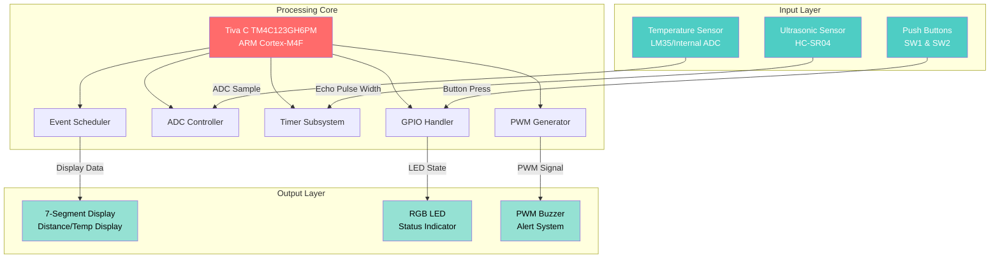

# Ultra Heat Sensor Alarm System
### Real-Time Embedded Safety Monitoring System

<!-- Video Demo Placeholder -->
> **🎥 [Project Demo Video](YOUR_VIDEO_LINK_HERE)**  
> *Click to watch the system in action*

---

## 🚀 Project Overview

The **Ultra Heat Sensor Alarm System** is a sophisticated embedded safety monitoring system built on the Texas Instruments Tiva C microcontroller (ARM Cortex-M4F). This system provides real-time environmental monitoring through dual-mode operation: distance detection using ultrasonic ranging and temperature sensing with visual/audible alerts.

Originally developed as a comprehensive embedded systems project, this system showcases advanced firmware engineering, hardware-software integration, and real-time event-driven architecture—all implemented in C and ARM assembly.

### Key Highlights
- ⚡ **Real-time multi-sensor processing** with interrupt-driven architecture
- 🎯 **Dual operational modes** - distance detection and heat monitoring
- 🔊 **Dynamic audio feedback** with PWM-controlled buzzer system
- 📊 **Multi-level alert system** with color-coded LED indicators
- 🧮 **Custom seven-segment display driver** for real-time data visualization
- 🛠️ **Mixed C/Assembly implementation** demonstrating low-level hardware control

---

## 🏗️ System Architecture



### System Components

| Component | Function | Interface |
|-----------|----------|-----------|
| **Ultrasonic Ranger (HC-SR04)** | Distance measurement (0-5+ feet) | GPIO PD1 / Timer Capture |
| **Temperature Sensor** | Ambient temperature monitoring | ADC0 (Internal/External) |
| **4-Digit 7-Segment Display** | Real-time data visualization | I2C/GPIO |
| **RGB LED (Onboard)** | Multi-color status indication | GPIO PF1-PF3 |
| **PWM Buzzer** | Audible alert with variable intensity | Timer PWM (PC5) |
| **Push Buttons (SW1/SW2)** | Mode selection interface | GPIO PF0, PF4 |

---

## ✨ Features

### Distance Detection Mode (Ultrasonic Ranging)
- **Precision ranging** up to 5+ feet with inch-level accuracy
- **Three-tier alert system:**
  - 🟢 **Safe Zone (≥5 ft):** Green LED, no alarm
  - 🟡 **Caution Zone (2-5 ft):** Yellow LED, intermittent low-volume buzzer
  - 🔴 **Danger Zone (<2 ft):** Red LED, continuous high-volume alarm
- Real-time distance displayed as `XX:XX` (feet:inches) on 7-segment display

### Temperature Monitoring Mode
- **High-precision temperature sensing** with 0.1°F resolution
- Continuous ADC sampling with digital filtering
- **Heat threshold detection:** 
  - 🟢 Normal (<90°F): Green LED
  - 🔴 Critical (≥90°F): Red LED + audible alarm
- Live temperature display with decimal precision

### Event-Driven Architecture
- **Non-blocking operation** using event scheduler and timer interrupts
- Concurrent sensor polling without processor stalling
- Efficient state machine implementation for mode management
- **WFI (Wait For Interrupt)** power optimization

### Advanced Audio System
- **PWM-based tone generation** with programmable pitch (C4-B4 musical scale)
- Three-level volume control (10%, 20%, 40% duty cycle)
- Separate alarm patterns for distance vs. temperature alerts
- Assembly-optimized PWM configuration for precise timing

---

## 📂 Project Structure

```
Ultra_Heat_Sensor/
├── src/
│   ├── core/
│   │   ├── LabProj.c              # Main application & event scheduler
│   │   ├── tm4c123gh6pm_startup_ccs.c  # Startup code & vector table
│   │   └── tm4c123gh6pm.cmd       # Linker script
│   ├── sensors/
│   │   ├── ranger.c/h             # Ultrasonic sensor driver
│   │   ├── temp_sensor.c/h        # Temperature sensor & ADC
│   │   └── temp_sensor_asm.asm    # Assembly ADC routines
│   ├── display/
│   │   ├── seg7digit.c            # 7-segment display driver
│   │   ├── seg7raw.c              # Low-level display interface
│   │   └── seg7.h                 # Display data structures
│   └── audio/
│       ├── buzzer.c/h             # Basic buzzer control
│       ├── buzzer_asm.asm         # Assembly buzzer routines
│       ├── pwm_buzzer.c/h         # PWM buzzer driver
│       ├── music_buzzer.c         # Musical tone generator
│       ├── pwm_led.c/h            # PWM LED control
│       └── music.h                # Audio configuration
├── hardware/
│   └── (Hardware schematics & datasheets)
├── docs/
│   └── (Technical documentation)
├── Debug/
│   └── (Build artifacts & debug symbols)
├── .cproject, .project            # Code Composer Studio config
└── README.md                      # This file
```

---

## 🔧 Technical Implementation

### Interrupt Service Routines (ISRs)
- **Timer Capture ISR:** Measures ultrasonic echo pulse width with microsecond precision
- **ADC Completion ISR:** Processes temperature sensor readings
- **GPIO ISR:** Debounced button press detection

### Peripheral Configuration
- **Wide Timer 2:** Ultrasonic pulse measurement via edge detection
- **ADC0 Sequencer 0:** Temperature sampling with processor trigger
- **Wide Timer 0:** PWM generation for buzzer (variable frequency/duty cycle)
- **Timer 0/1:** LED PWM for RGB color mixing

### Calculations & Algorithms
```c
// Distance calculation from ultrasonic pulse width
distance_inches = (pulse_width_ticks * 12) / 89657;

// Temperature conversion (ADC → °F)
temp_celsius = (ADC_raw * 3.3 / 4096 - 0.5) / 0.01;
temp_fahrenheit = temp_celsius * 9/5 + 32;
```

---

## 🛠️ Build & Development

### Hardware Requirements
- **Texas Instruments Tiva C Series TM4C123GH6PM LaunchPad**
- HC-SR04 Ultrasonic Sensor (or compatible)
- LM35 Temperature Sensor (or use internal ADC temp sensor)
- 4-Digit 7-Segment Display (I2C/Grove compatible)
- Passive buzzer (PWM-compatible)
- Grove Base BoosterPack (optional, for easier connections)

### Software Requirements
- **Code Composer Studio (CCS)** v12.0 or later
- TivaWare Peripheral Driver Library
- ARM Compiler Tools

### Building the Project
1. Clone this repository
2. Open the project in Code Composer Studio
3. Ensure TivaWare library path is configured correctly
4. Build the project (Project → Build All)
5. Flash to Tiva C LaunchPad via USB

### Pin Configuration
| Peripheral | Tiva Pin | Grove Port | Notes |
|------------|----------|------------|-------|
| Ultrasonic Trigger/Echo | PD1 | J6 Pin 24 | Timer WT2CCP1 |
| Temp Sensor (ADC) | PE3 or Internal | J6 Pin 25 | ADC0 Ch0 |
| Buzzer | PC5 | J17 | Timer WT0CCP1 |
| 7-Segment Display | I2C (PB2/PB3) | J8 | I2C0 SCL/SDA |
| RGB LED | PF1-PF3 | Onboard | Red/Blue/Green |
| Push Buttons | PF0, PF4 | Onboard | SW1/SW2 |

---

## 🎓 Skills Demonstrated

This project showcases proficiency in:

### Embedded Systems Engineering
- ✅ Bare-metal firmware development (no RTOS)
- ✅ Interrupt-driven event scheduling
- ✅ Hardware abstraction layer (HAL) design
- ✅ Real-time constraint management

### Low-Level Programming
- ✅ Mixed C and ARM assembly programming
- ✅ Direct peripheral register manipulation
- ✅ Memory-mapped I/O
- ✅ Pointer arithmetic and bit manipulation

### Hardware Interfacing
- ✅ ADC sampling and signal conditioning
- ✅ PWM generation and motor control principles
- ✅ Timer/counter configuration
- ✅ GPIO interrupt handling with debouncing

### System Design
- ✅ State machine implementation
- ✅ Modular code architecture
- ✅ Sensor fusion (combining multiple inputs)
- ✅ Power-efficient design patterns (WFI instruction)

---

## 📊 Performance Metrics

| Metric | Value |
|--------|-------|
| **Distance Measurement Range** | 2 inches - 5+ feet |
| **Distance Resolution** | ±1 inch |
| **Temperature Range** | 0°F - 150°F |
| **Temperature Resolution** | 0.1°F |
| **Sensor Polling Rate** | 2 Hz (500ms intervals) |
| **Alert Response Time** | <100ms |
| **Audio Frequency Range** | 261 Hz (C4) - 494 Hz (B4) |
| **Power Consumption** | ~200mA @ 5V (active mode) |

---

## 🚀 Future Enhancements

Potential improvements for production deployment:

- [ ] **Wireless connectivity** (WiFi/Bluetooth) for remote monitoring
- [ ] **Data logging** with SD card or cloud storage
- [ ] **Multiple sensor nodes** with mesh networking
- [ ] **Mobile app interface** for configuration and alerts
- [ ] **Machine learning** for anomaly detection patterns
- [ ] **Battery power** with sleep mode optimization
- [ ] **OLED display** for richer UI/graphical feedback

---

## 📜 License

This project is open-source and available under the **MIT License**. Feel free to use, modify, and distribute with attribution.

---

## 👤 Author

**Akbar Aman**  
Embedded Systems Engineer | ARM Developer | IoT Enthusiast

- 🔗 [LinkedIn](YOUR_LINKEDIN_URL)
- 💼 [Portfolio](YOUR_PORTFOLIO_URL)
- 📧 [Email](mailto:YOUR_EMAIL)

---

## 🙏 Acknowledgments

- **Course:** ECE 266 - Embedded Systems  
- **Institution:** [Your University Name]
- **Original Project Context:** Final Lab Project, Fall 2024
- **Hardware Platform:** Texas Instruments Tiva C Series
- **Framework:** TivaWare™ Peripheral Driver Library

---

<div align="center">

**⭐ Star this repository if you find it useful!**

*Built with precision. Coded with passion. Engineered for impact.*

</div>
